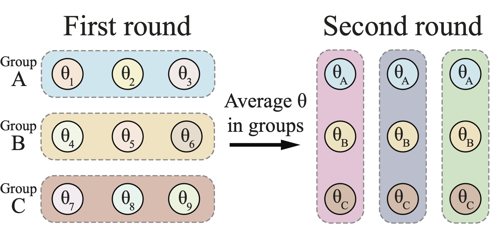

# Moshpit SGD: Communication-Efficient Decentralized Training on Heterogeneous Unreliable Devices



This repository contains the official PyTorch implementation of experiments for
the [paper](https://arxiv.org/abs/2103.03239).

**Note (05.03.2021):** as of now, this repository contains only the minimal (largely untested) version of the
implementation. We intend to make the training code more robust and to add tested code for more experiments (including
image classification) in the coming months. In the meantime, feel free to create
an [issue](https://github.com/yandex-research/moshpit-sgd/issues) or contact us by [email](mailto:mryabinin0@gmail.com)
if you are having any troubles.

## Setup

To launch the code in this repository, you will need Python 3.8+ and PyTorch 1.7. Also, install the dependencies by
running `pip install -r requirements.txt`.

## Experiments

The links below The first experiment is a self-contained Jupyter notebook; for the other two experiments, refer to
README.md in their respective directories:

* [Averaging quality](https://github.com/yandex-research/moshpit-sgd/blob/main/averaging_experiments.ipynb)
* [Language modeling](https://github.com/yandex-research/moshpit-sgd/tree/main/language_modeling)

## References

```
@misc{ryabinin2021moshpit,
      title={Moshpit SGD: Communication-Efficient Decentralized Training on Heterogeneous Unreliable Devices}, 
      author={Max Ryabinin and Eduard Gorbunov and Vsevolod Plokhotnyuk and Gennady Pekhimenko},
      year={2021},
      eprint={2103.03239},
      archivePrefix={arXiv},
      primaryClass={cs.LG}
}
```
